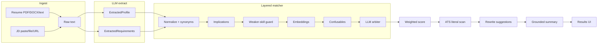
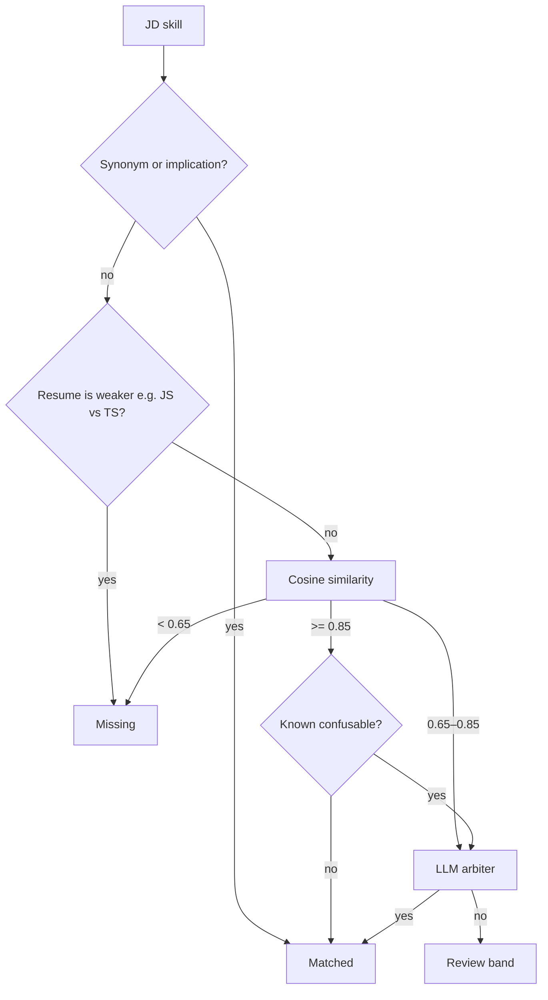

# ResumeMatch

Resume ↔ Job Description gap analyzer. Next.js frontend + FastAPI backend.
Ollama-first LLM/embeddings with a pluggable provider seam for Claude/etc. later.

## Day 3 status

- **ATS keyword check** — literal phrase scan of resume text vs JD `ats_phrases` (separate from semantic gaps)
- **Rewrite suggestions** — LLM bullet rewrites for review/missing skills with honesty guardrails
- **Multi-JD compare** — `POST /analyze/compare` (up to 3 JDs), ranked cards + tab switching in UI
- **Score history** — last 20 runs in `localStorage` (score, JD label, timestamp, compare breakdown)
- **UI polish** — Recharts category bar chart, ATS sections, rewrite cards, compare mode auto-detect

## Day 2 status

- Layered skill matcher: normalize → synonyms → embeddings → confusables → LLM arbiter
- Weighted scoring (required / experience / nice-to-have / domain) with category breakdown
- Grounded LLM summary from structured match data (not raw documents)
- Labeled eval set (`backend/eval/skill_pairs.jsonl`, 30 pairs) + precision/recall script
- Unit tests for normalization, confusables, thresholds, scoring sanity checks

## Day 1 status

- Scaffold, CORS, health, mirrored Pydantic/Zod schemas
- PDF/DOCX/URL ingest
- LLM structured extraction (resume + JD) with validation retry
- `/analyze` live extraction + semantic matching; `/analyze/stub` for UI without Ollama
- Frontend upload/paste UI with up to 3 JD slots

## API

| Endpoint | Description |
|----------|-------------|
| `GET /health` | Status + provider config |
| `POST /analyze` | Single resume vs one JD |
| `POST /analyze/stub` | Hardcoded single-JD response |
| `POST /analyze/compare` | One resume vs up to 3 JDs (ranked) |
| `POST /analyze/compare/stub` | Hardcoded compare response |

When two or more JD slots are filled in the UI, the frontend calls `/analyze/compare` automatically.

## Matching pipeline



For each JD skill, layers run in order until one decides:



1. **Normalize** — lowercase, collapse `.js` suffixes, synonym map (`react.js`→`react`, `js`→`javascript`, `html5`→`html`)
2. **Implications** — TypeScript covers JavaScript (not the reverse); CSS/HTML cover each other; Sass/Tailwind cover CSS; React/Next.js cover JavaScript
3. **Weaker-skill guard** — JavaScript does not cover TypeScript even if embeddings are close
4. **Embed** — Ollama `nomic-embed-text`; cosine similarity between resume and JD skills
5. **Thresholds** — match ≥0.85, review 0.65–0.85 (tunable via `MATCH_THRESHOLD` / `REVIEW_THRESHOLD`)
6. **Confusables** — `java`↔`javascript`, `aws`↔`azure`, etc. never auto-match on embedding alone
7. **LLM arbiter** — review-band pairs only; targeted yes/no grounded prompt

**Score weights:** required skills 55% · years/seniority 20% · nice-to-have 15% · domain 10%.

## Quick start

### Backend

```bash
cd backend
python3 -m venv .venv
source .venv/bin/activate
pip install -r requirements.txt
cp .env.example .env
# Ensure Ollama is running with chat + embed models:
#   ollama pull llama3.1:8b
#   ollama pull nomic-embed-text
uvicorn app.main:app --reload --port 8000
```

Default chat model is `llama3.1:8b` (override via `OLLAMA_CHAT_MODEL`).
Set `ANALYZE_STUB=true` in `.env` to skip Ollama entirely.
Set `GENERATE_REWRITES=false` to skip rewrite LLM calls.

### Frontend

```bash
cd frontend
npm install
npm run dev
```

Open http://localhost:3000 — enable **Demo mode** to render stub ATS/rewrite/compare without Ollama.

### Tests

```bash
cd backend && source .venv/bin/activate
PYTHONPATH=. pytest -q
PYTHONPATH=. python eval/run_eval.py   # optional: embedding precision/recall
```

### Smoke test checklist

- [ ] Upload resume + paste JD → score, gaps, summary
- [ ] ATS found/missing sections show literal keyword hits
- [ ] Rewrite suggestions appear for stub or live gaps
- [ ] Add 2–3 JDs → compare ranks roles; click cards to switch detail view
- [ ] Re-run analysis → score history list grows (localStorage)

## Provider swap

`LLM_PROVIDER` / `EMBEDDING_PROVIDER` default to `ollama`. Call sites use
`get_chat_provider()` / `get_embedding_provider()` only. To add Claude later:
implement adapters under `backend/app/llm/` and register them in
`provider.py` — no changes to extraction or matching code.

## Known limitations

- Pydantic ↔ Zod schemas are hand-mirrored (no codegen)
- Score history is browser-local only — no accounts or backend persistence
- ATS check is literal substring match (by design — mirrors dumb ATS scanners)
- Rewrite suggestions need human review; guardrails reduce but don't eliminate overclaiming
- PDF two-column layouts may jumble reading order (documented Day 1)
